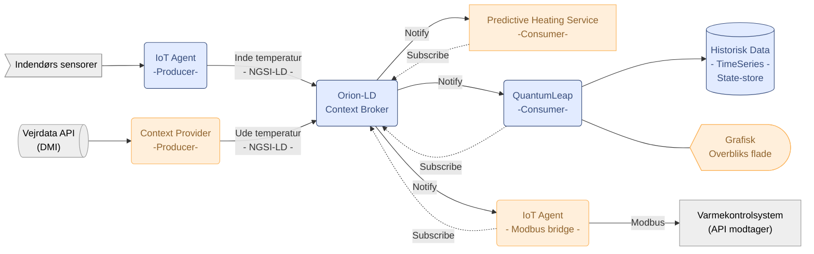



Udkast  
{: .label .label-yellow }

## Baggrund

<!-- [Beskriv den kontekst eller problemstilling, som dokumentet adresserer.] -->
<!-- [Hvad er de nuværende udfordringer, og hvorfor er der behov for denne indsats?] -->

# Arkitektur anbefaling

---

> ### Det anbefales at sammensætte en robust, genbrugelig løsning der er kosteffektiv at vedligeholde ved at anvende eksisterende løsninger og datastandarder

## Komponenter
_Arkitekturlandskab_

---

Højniveau arkitekturlandskab i mermaid

#### **[NGSI-LD](https://fiware-datamodels.readthedocs.io/en/stable/ngsi-ld_howto/) (Next Generation Service Interface - Linked Data)**

> Den åbne datastandard (specificeret af ETSI), der definerer, hvordan 

#### **[Komponent A](https://link/) (Beskrivende linktekst)**

> Komponent A beskrivelse

OSS Datamodel imod Danfoss ECL: https://github.com/smart-data-models/dataModel.Device/blob/master/Modbus/README.md

Tutorial example: https://ngsi-ld-tutorials.readthedocs.io/en/latest/time-series-data.html

Opsummering: <!-- komponent opsummering med links -->

# Forventede gevinster
---

### <!-- f.eks 💰 Reduktion af driftsbyrden -->
> Brødtekst med **effekten** i bold

# Anvendte arkitekturprincipper
