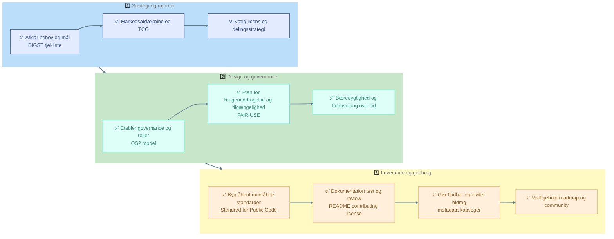

# ♻️ Genbrugs-kriterier for Open Source  
✅ _Hvordan du gør dit projekt nemt at finde, forstå og genbruge –  3 hurtige trin_

 

## 1️⃣ Strategi og rammer
- [ ] Afklar behov og mål ([DIGST Vejledning om open source](https://arkitektur.digst.dk/sites/default/fileuploads/Tjekliste_til_brug_af_open_source_i_den_offentlige_sektor.pdf))
- [ ] Vælg åben licens og delingsstrategi ([DIGST Tjekliste til Standard for Offentlig Kode (PDF)](https://arkitektur.digst.dk/sites/default/fileuploads/Tjekliste_til_Standard_for_Offentlig_Kode_version_0.7.1.pdf))
- [ ] Lav markedsafdækning og TCO‑vurdering ([DIGST Strategier for genbrug og fællesudvikling](https://arkitektur.digst.dk/metoder/arkitekturmetoder/introduktion-til-vejledning-om-brug-af-open-source-i-den-offentlige-sektor))

## 2️⃣ Design og governance
- [ ] Etabler governance og roller ([OS2 Governance-model](https://www.os2.eu/governance))
- [ ] Planlæg brugerinddragelse og tilgængelighed ([FAIR-USE4OS Guidelines](https://journals.plos.org/ploscompbiol/article?id=10.1371/journal.pcbi.1012045))
- [ ] Sikr bæredygtighed og finansiering over tid ([OS2 Governance-rapport skabelon](https://github.com/OS2offdig))

## 3️⃣ Leverance og genbrug
- [ ] Byg åbent med åbne standarder ([Standard for Public Code](https://standard.publiccode.net/criteria/))
- [ ] Dokumentér kode, test og review ([GitHub Open Source Guide](https://opensource.guide/how-to-contribute/))
- [ ] Gør løsningen findbar og inviter bidrag ([opensource.guide – Building welcoming communities](https://opensource.guide/building-community/))
- [ ] Vedligehold roadmap og community ([OS2 GitHub](https://github.com/OS2offdig))

 

  
  Klik for at folde ud og se hele processen
  

 

# Spørgsmål og svar

 

  
❓ Hvad skal man tjekke for, når man offentliggør koden?

   
  <strong>✅ Hold koden ren for adgangsoplysninger og miljøspecifikke filer</strong> 
  Inden I offentliggør koden, skal I sikre, at der ikke ligger nogen form for data i repoet, som kan være følsomme, miljøspecifikke eller irrelevante for andre brugere.
  <pre><code>
📌 Best practice:
  - Brug miljøvariabler til konfiguration – ingen adgangsoplysninger i koden
  - Tilføj en eksempelfil som `config.example.env` og dokumenter hvordan den anvendes
  - Brug `.gitignore` til at udelukke `.env`, `config.*`, `*.log`, `.pem` osv.
  - Dokumentér i `README.md`, hvordan man opsætter miljøet lokalt

🚫 Undgå:
  - Følsomme oplysninger og credentials: API-nøgler, tokens, brugernavne, adgangskoder
  - Miljøspecifikke filer: Produktionskonfigurationer, interne URL’er, IP-adresser
  - Data og logfiler: Produktionsdata, testdata med rigtige oplysninger
  - Intern kontekst: Referencer til interne systemer eller dokumentation
  - Midlertidige filer: Lokale udviklingsfiler, cache, build-artifacts

✅ Men inkluder gerne:
  - Syntetiske eller anonymiserede data til eksempler og tests
  - Eksempelfiler til konfiguration, f.eks. `config.example.env`
  - Dokumentation for hvordan man selv tilføjer konfiguration
  </code></pre>

  
❓ Hvilke tests skal man lave?

   
  <strong>✅ Automatiske tests og dokumenteret testmiljø øger kvaliteten</strong> 
  For at sikre at softwaren fungerer som forventet – både nu og i fremtiden – bør der være automatiske tests og en klar beskrivelse af testmiljøet.
  <pre><code>
📌 Best practice:
  - Automatiske tests med CI-værktøjer som GitHub Actions eller GitLab CI
  - Linting og formattering med IDE eller CI
  - Enhedstests og integrationstests – gerne med input fra brugere
  - Dokumentér teststrategi og testdata i `tests/` eller `README.md`
  - Inkluder eksempelfiler til testmiljøopsætning

🚫 Undgå:
  - Tests der afhænger af interne systemer eller netværk

✅ Men inkluder gerne:
  - CI-konfiguration: f.eks. `.github/workflows/test.yml`
  - Eksempler på testkommandoer i `README.md` eller `CONTRIBUTING.md`
  - Syntetiske testdata til realistiske scenarier
  </code></pre>

  
❓ Hvilken dokumentation skal man tilknytte?

   
  <strong>✅ God dokumentation gør projektet lettere at forstå og genbruge</strong> 
  Dokumentation er en nøglekomponent i open source-projekter – både for nye brugere og for genbrug.
  <pre><code>
📌 Best practice:
  - Inkluder altid en README.md med introduktion og brug
  - Vis konkrete eksempler på anvendelse
  - Beskriv miljøopsætning og nødvendige variabler
  - Tilføj templates til udrulning med åbne værktøjer

🚫 Undgå:
  - Ufuldstændig eller forældet dokumentation
  - Antagelser om intern viden
  - Dokumentation i lukkede systemer eller proprietære formater

✅ Men inkluder gerne:
  - Diagrammer og arkitekturtegninger (f.eks. Mermaid)
  - Links til relevante issues eller diskussioner
  - En `CONTRIBUTING.md` med bidragsvejledning
  </code></pre>

  
❓ Hvor skal man offentliggøre det?

   
  <strong>✅ Brug åbne og tilgængelige platforme</strong> 
  For at sikre at din kode er nem at finde og bidrage til, bør du bruge en platform med versionsstyring og samarbejdsværktøjer.
  <pre><code>

📌 Best practice:
  - Brug GitHub, GitLab, Codeberg eller SourceHut
  - Gør projektet offentligt
  - Tilføj en open source-licens (MIT, Apache 2.0, GPL)
  - Brug README.md som landing page

🚫 Undgå:
  - Lukkede platforme eller interne systemer
  - At offentliggøre uden README, licens eller dokumentation
  - Platforme uden versionsstyring (f.eks. Google Drive)

✅ Men inkluder gerne:
  - Link til repoet i artikler, præsentationer eller dokumenter
  - `CONTRIBUTING.md` og `CODE_OF_CONDUCT.md` for bidrag
  </code></pre>

 

# 📚 Baggrundsmateriale

  
🏛 1. DIGST – Strategi og rammer for open source

- [DIGST Vejledning om open source](https://arkitektur.digst.dk/metoder/arkitekturmetoder/introduktion-til-vejledning-om-brug-af-open-source-i-den-offentlige-sektor)

  
🤝 2. OS2 Governance-model og fællesudvikling

- [Governancemodellen – OS2](https://www.os2.eu/governance)
- [Fem trin til at komme godt i gang](https://www.os2.eu/kom-i-gang)
- [OS2 GitHub – asessment og governance templates](https://github.com/OS2offdig/governance_report_template)  

  
🫶 3. FAIR-principperne og FAIR-USE4OS (design og impact)

- [FAIR for Beginners – DeiC](https://www.deic.dk/en/data-management/instructions-and-guides/FAIR-for-Beginners)  
- [Guidelines for creating impactful open-source software (FAIR-USE4OS)](https://journals.plos.org/ploscompbiol/article?id=10.1371/journal.pcbi.1012045)  
- [The FAIR Principles for Data and Software](https://www.sheffield.ac.uk/openresearch/resources/fair-data-and-software-principles)  
- [Translating the FAIR principles to code](https://rse.sheffield.ac.uk/training/fair4rs/)  

  
📖 4. Standard for Public Code (kvalitet og genbrugsklarhed)

- [Standard for Public Code – Officiel side](https://standard.publiccode.net/)  
- [GitHub-repo med eksempler og issues](https://github.com/publiccodenet/standard)  
- [Kriterier og tjekliste](https://standard.publiccode.net/criteria/)  

  
🌍 5. Open Source Guide (community og vedligehold)

- [opensource.guide – Community-drevet guide til open source](https://opensource.guide/)  
- [How to contribute to open source](https://opensource.guide/how-to-contribute/)  
- [Building welcoming communities](https://opensource.guide/building-community/)  

