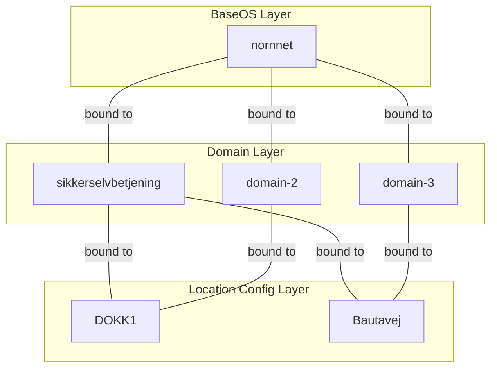

# Bootable Container Image Layers

## Layer Descriptions

- **BaseOS (nornnet)** — Foundational bootable container image providing the base operating system.
- **Domain** — Mid-tier images providing domain-specific functionality (e.g., `sikkerselvbetjening`, `domain-2`, `domain-3`). Each is logically bound to a BaseOS image.
- **Location Config** — Top-tier images applying site-specific configuration (e.g., `DOKK1`, `Bautavej`). Each is logically bound to one or more domain images.
