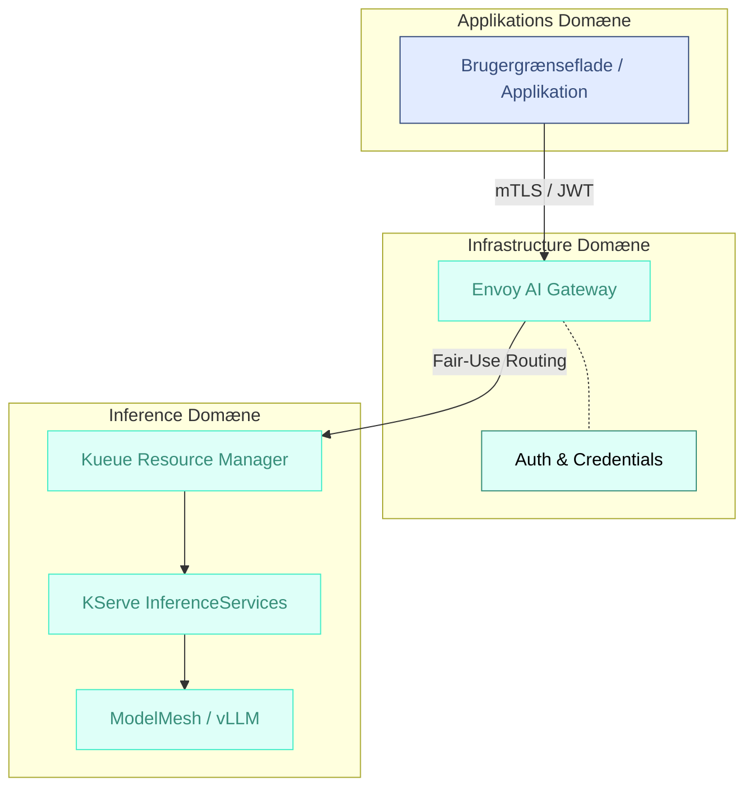



Udkast  
{: .label .label-yellow }

## Baggrund

For at sikre en solidarisk adgang til sprogmodeller i OS2ai vil tilføjelsen af en *“LLM as a Service”* løsning til OS2ai kunne levere:
- **Flatrate betaling** (baseret på organisationsstørrelse)
- **Fair-use solidaritetsmodel** (Fair-use pooling af ressourcer)
- **Høj sikkerhed** (Ingen læk af data til eksterne API'er)

# Arkitektur anbefaling

> ### Det anbefales at følge internationale Cloud Native referencearktitekturer og implementere en løsning baseret på **Envoy AI Gateway**, **Kueue** og **KServe**. En sådan model adskiller adgangs- og ressource-styring fra selve model-afviklingen og sikrer en ægte cloud-native platform.

Denne løsning:
- **Standardiserer adgang:** Bruger Envoy AI Gateway til at skabe én samlet, sikker indgang for alle organisationer.
- **Sikrer Fair-Use:** Bruger **Kueue** til at styre ressourcefordeling (GPU-kvoter) på tværs af organisationer gennem en solidarisk model.
- **Løskobler applikation og model:** Applikationer taler med en stabil gateway, mens modellerne kan opdateres eller skiftes i baggrunden uden nedetid.
- **Følger 12/15-faktor principper:** Alt er deklarativt, stateless og konfigureret som kode (Config-as-Code) uden procedurale indgreb i containers.
- **Er 100% OSI-compliant:** Baseret udelukkende på CNCF open source-projekter, hvilket sikrer mod leverandørbindinger.

## Komponenter
_Arkitekturlandskab_

---

### [Envoy AI Gateway](https://aigateway.envoyproxy.io/)
**Det strategiske kontrolpunkt.** Håndterer identifikation af alle organisationer, injicerer API-nøgler sikkert (Credential Injection) og håndterer routing. Det sikrer, at applikationskoden aldrig "ser" følsomme nøgler, og at data ikke flyder til ikke-godkendte eksterne services.

### [Kueue](https://kueue.sigs.k8s.io/)
**Solidaritets-motoren.** Styrer hvem der får lov at bruge GPU'erne "lige nu". Hvis én myndighed bruger hele sin kvote, holder Kueue deres requests i kø, indtil der er ledig kapacitet, så de ikke "stjæler" fra naboen, men stadig kan udnytte ledig overskudskapacitet via "borrowing".

### [KServe](https://kserve.github.io/website/) & [ModelMesh](https://kserve.github.io/archive/0.8/modelserving/mms/modelmesh/overview/)
**Produktionsmaskinen.** Automatiserer udrulning af modeller som skalerbare services. ModelMesh gør det muligt at køre mange forskellige modeller på få GPU'er ved at dele hukommelsen effektivt, hvilket er essentielt for at holde prisen nede i en flatrate-model.

# Forventede gevinster

### 💰 Solidarisk og forudsigelig økonomi
Ved at bruge Envoy og Kueue kan vi garantere kapacitet til alle, samtidig med at vi tillader "lån" af ledig kapacitet på tværs af platformen. Det fjerner behovet for kompleks token-afregning og understøtter en ren flatrate-struktur.

### 🔒 Enterprise Sikkerhed & Governance
Al trafik monitoreres via standard OpenTelemetry logning. Vi får fuldt overblik over anvendelse pr. organisation på netværksniveau, hvilket gør revision og auditering muligt uden specialudviklet kode.

### 🌱 Grøn IT og optimeret drift
Scale-to-zero og intelligent GPU-pooling kan minimere tomgangskørsel, hvilket reducerer både CO2-aftryk og de faktiske hostingomkostninger for de deltagende organisationer.

## Anvendte arkitekturprincipper  
Forslaget understøtter følgende fællesoffentlige principper:

[♻️ Genbrug og fælles løsninger](https://arkitektur.digst.dk/principper-og-regler){: .btn .btn-green } [👁️ Åbne standarder](https://arkitektur.digst.dk/principper-og-regler){: .btn .btn-green } [🧩 Modularitet og løskobling](https://arkitektur.digst.dk/principper-og-regler){: .btn .btn-green } [🔒 Sikkerhed og robusthed](https://arkitektur.digst.dk/principper-og-regler){: .btn .btn-green } [🌱 Grøn IT](https://arkitektur.digst.dk/principper-og-regler){: .btn .btn-green } [📏 Governance](https://arkitektur.digst.dk/principper-og-regler){: .btn .btn-green }  

## Kilder
- [Envoy AI Gateway Reference Architecture](https://aigateway.envoyproxy.io/blog/envoy-ai-gateway-reference-architecture)
- [Kueue: Multi-tenant batch and AI scheduling](https://kueue.x-k8s.io/)
- [KServe: Scalable Model Serving](https://kserve.github.io/website/)
- [Cloud Native AI Whitepaper (CNCF)](https://www.cncf.io/reports/cloud-native-ai-whitepaper/)