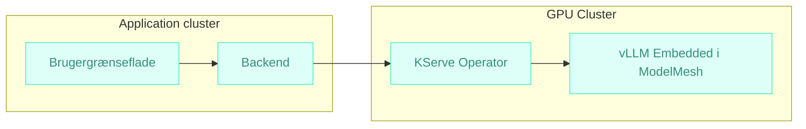



Udkast  
{: .label .label-yellow }

## Baggrund

Styregruppen i os2ai har længe ønsket sig en løsning for *“LLM as a Service”* med:
- **Flatrate betaling** 
- **Solidaritetsmodel**

Tidligere forsøg har ikke leveret en skalerbar og fair løsning. Samtidig er der et stigende behov for at reducere energiforbrug og driftsomkostninger.

# Arkitektur anbefaling

---

> ### Det anbefales at anvende **KServe med ModelMesh** på den eksisterende Kubernetes-platform for at udnytte de muligheder vi allerede betaler for i vore k8s cluster til at levere 

Denne løsning:
- Udnytter de k8s native **operators og funktionalitet** vi allerede betaler for.
- Genbruger eksisterende internationalt vedligeholdte løsninger, istedet for at opfinde en ny dyb tallereken.
- Understøtter **multi-tenancy og model-sharing** for effektiv ressourceudnyttelse
- Muliggør **scale-to-zero** og GPU-pooling → lavere energiforbrug og hostingpris
- Er **CNCF open source** og cloud-neutral

## Komponenter
_Arkitekturlandskab_

---

### [Kserve](https://kserve.github.io/website/)
> Skalerbar inferencing med multi-tenancy og dynamisk model-loading og skalering.

### [ModelMesh](https://github.com/kserve/modelmesh)
> Avanceret runtime til multi-model hosting med memory-optimering.
Gør det muligt at have mange modeller tilgængelige uden at alle fylder i GPU-hukommelsen samtidig.
Integrerer med KServe for dynamisk model-loading og routing.

# Forventede gevinster

### 💰 Fair og forudsigelig økonomi
> Faste tiers med flatrate muliggør solidarisk prisstruktur.

### 🌱 Grøn IT og lavere hostingpris
> Scale-to-zero og GPU-pooling reducerer energiforbrug og driftsomkostninger markant.

### 🔒 Robust og fremtidssikret
> CNCF open source og Kubernetes-native operators sikrer standardisering og leverandøruafhængighed.

# Anvendte arkitekturprincipper
---

## Anvendte arkitekturprincipper  
Forslaget understøtter følgende principper:

[♻️ Genbrug og fælles løsninger](https://arkitektur.digst.dk/principper-og-regler){: .btn .btn-green }  
> Vi anvender CNCF open source-komponenter (KServe, ModelMesh) frem for egenudvikling.

[👁️ Åbne standarder og interoperabilitet](https://arkitektur.digst.dk/principper-og-regler){: .btn .btn-green }  
> Kubernetes-native operators og åbne protokoller (REST/gRPC, OCI) sikrer leverandøruafhængighed.

[🧩 Modularitet og løskobling](https://arkitektur.digst.dk/principper-og-regler){: .btn .btn-green }  
> Komponenter kan udskiftes uden at påvirke resten af løsningen.

[🔒 Sikkerhed og robusthed](https://arkitektur.digst.dk/principper-og-regler){: .btn .btn-green }  
> RBAC, namespace-isolation og audit logs understøtter multi-tenancy og compliance.

[🌱 Grøn IT og effektiv ressourceudnyttelse](https://arkitektur.digst.dk/principper-og-regler){: .btn .btn-green }  
> Scale-to-zero og GPU-pooling reducerer energiforbrug og driftsomkostninger.

[📏 Standardisering og governance](https://arkitektur.digst.dk/principper-og-regler){: .btn .btn-green }  
> CNCF-standarder og Kubernetes-native operators sikrer fremtidssikret styring.
