

Udkast  
{: .label .label-yellow }

## Baggrund

Styregruppen i os2ai har længe ønsket sig en løsning for *“LLM as a Service”* med:
- **Flatrate betaling** 
- **Solidaritetsmodel**

# Arkitektur anbefaling

> ### Det anbefales at anvende **KServe** med **ModelMesh** for at udnytte de muligheder vi allerede betaler for i vore k8s cluster, til at levere på de ovenstående ønsker.

Denne løsning:
- Udnytter de k8s native **operators og funktionalitet** vi allerede betaler for.
- Genbruger eksisterende internationalt vedligeholdte løsninger, istedet for at opfinde nye dybe tallerkener.
- Understøtter **model-sharing** for effektiv ressourceudnyttelse
- Muliggør **scale-to-zero** og GPU-pooling for lavere energiforbrug og dermed forventet lavere hostingpriser
- Er **CNCF open source** og cloud-neutral

## Komponenter
_Arkitekturlandskab_

---

```mermaid
flowchart LR
    subgraph Application cluster
        A[Brugergrænseflade]
        B[Backend]
    end
    subgraph GPU Cluster
        C[KServe Operator]
        D[vLLM Embedded i ModelMesh]
    end

    A --> B --> C --> D

    A:::Aqua
    B:::Aqua
    C:::Aqua
    D:::Aqua
    classDef Sky stroke-width:1px, stroke-dasharray:none, stroke:#374D7C, fill:#E2EBFF, color:#374D7C
    classDef Ash stroke-width:1px, stroke-dasharray:none, stroke:#999999, fill:#EEEEEE, color:#000000
    classDef Aqua stroke-width:1px, stroke-dasharray:none, stroke:#46EDC8, fill:#DEFFF8, color:#378E7A
```

### [Kserve](https://kserve.github.io/website/)
> Skalerbar inferencing med multi-tenancy og dynamisk model-loading og skalering.

### [ModelMesh](https://github.com/kserve/modelmesh)
> Avanceret runtime til multi-model hosting med memory-optimering.
Gør det muligt at have mange modeller tilgængelige uden at alle fylder i GPU-hukommelsen samtidig.
Integrerer med KServe for dynamisk model-loading og routing.

# Forventede gevinster

### 💰 Fair og forudsigelig økonomi
> Faste tiers med flatrate muliggør solidarisk prisstruktur.

### 🌱 Grøn IT og lavere hostingpris
> Scale-to-zero og GPU-pooling reducerer energiforbrug og driftsomkostninger markant.

### 🔒 Robust og fremtidssikret
> CNCF open source og Kubernetes-native operators sikrer standardisering og leverandøruafhængighed.

## Anvendte arkitekturprincipper  
Forslaget understøtter følgende fællesoffentlige principper og regler:

[♻️ Genbrug og fælles løsninger](https://arkitektur.digst.dk/principper-og-regler){: .btn .btn-green } [👁️ Åbne standarder og interoperabilitet](https://arkitektur.digst.dk/principper-og-regler){: .btn .btn-green } [🧩 Modularitet og løskobling](https://arkitektur.digst.dk/principper-og-regler){: .btn .btn-green } [🔒 Sikkerhed og robusthed](https://arkitektur.digst.dk/principper-og-regler){: .btn .btn-green }  [🌱 Grøn IT og effektiv ressourceudnyttelse](https://arkitektur.digst.dk/principper-og-regler){: .btn .btn-green } [📏 Standardisering og governance](https://arkitektur.digst.dk/principper-og-regler){: .btn .btn-green }  

## Kilder

- https://developer.ibm.com/articles/llms-inference-scaling-vllm-kserve/
- https://developer.ibm.com/blogs/kserve-and-watson-modelmesh-extreme-scale-model-inferencing-for-trusted-ai/