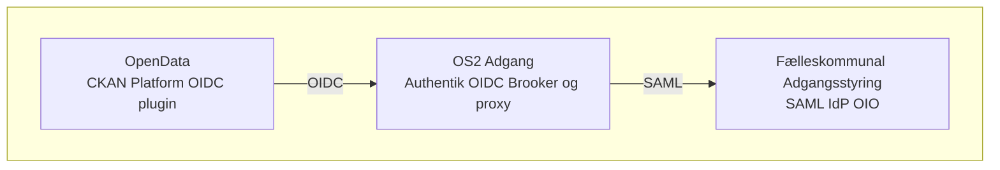

# Arkitekturanbefaling
## OpenData.dk integration med FKa

Udkast
{: .label .label-yellow }

_Brug af [Authentik](https://goauthentik.io/) som identitetsbro for den CKAN baserede dataportal OpenData.dk_

## Baggrund
_Givet opgaven at integrere OpenData platformen med Fælleskommunal Adgangsstyring (FKA) anbefales følgende:_

Det anbefales at genbruge **OS2 Adgang**, baseret på upstream-projektet [*Authentik*](https://goauthentik.io/), som identitetsbro.
Det anbefales at undgå direkte integration med en hård SAML binding i CKAN.

## Anbefaling
_Investér i en moderne og modulær løsning hvor OS2Adgang håndterer adgangsstyring og eksponerer en OIDC-grænseflade til CKAN. Dette bygger videre på eksisterende arbejde og standarder._

### De tre vigtigeste gevinster:

### 1. Fremtidssikret og standardiseret løsning
Ved at vælge OpenID Connect (OIDC) får men en moderne, sikker og bredt understøttet standard, som allerede anvendes af førende cloud- og SaaS-platforme. Implementeret i en seperat komponent reducerer et sådant arkitekturvalg risici for teknisk gæld, leverer et separat lag uden for applikationen der beskytter mod sårbarheder og gør det nemt at tilføje nye identitetsudbydere (IdP’er) fremadrettet.

### 2. Modulær arkitektur med klar ansvarsfordeling
Det anbefales at adgangsstyringen isoleres i en dedikeret komponent, hvilket giver en tydelig adskillelse mellem applikation og identitetshåndtering. Det øger sikkerheden og muliggører genanvendelse på tværs af systemer- En løskoblet løsning bliver lettere at vedligeholde og understøtter domænespecifikke funktioner som f.eks compliance og audit ad adgange og brugerhændelser.

### 3. Skalerbarhed og fleksibilitet til fremtidige behov
Løsningen er designet til at vokse med organisationens behov. Den understøtter integrationer på tværs af platforme, sikrer en ensartet brugeroplevelse og genbruger eksisterende komponenter – fx OS2’s SAML bidrag til Authentik – på tværs af projekter.

 

## Forudsætninger for succes

- **Teknisk opsætning og test**: Afsæt ressourcer til tilpasning af eksisterende CKAN OIDC plugin og korrekt implementering + test af konfigurationer, herunder claims mapping og redirect-URI’er.
- **Dokumentation**: Klar dokumentation og overblik over autentificeringsflowet og de krævede arbejdsgange i KOMBIT systemerne er afgørende for en genbrugelig løsning og er en vigtig brik i en exit-strategi og leverer muligheden for et flerleverandør setup.
- **Overvågning og vedligehold**: Authentik bliver en central komponent og bør overvåges og vedligeholdes på lige fod som resten af infrastrukturen den betjener.

 

## Løsnings overblik

