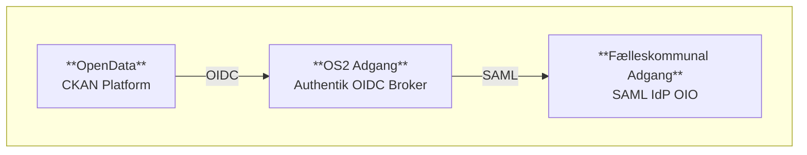

# Arkitekturanbefaling
## Brug af Authentik som identitetsbro for CKAN

## Baggrund
Givet opgaven at integrere OpenData platformen med FKA anbefales følgende:
Det anbefales at genbruge **OS2 Adgang**, baseret på upstream-projektet *Authentik*, som identitetsbro.
Det nabefales at undgå direkte integration med en hård binding i CKAN.

## Anbefaling
_Investér i en moderne og modulær løsning hvor OS2Adgang håndterer adgangsstyring og eksponerer en OIDC-grænseflade til CKAN. Dette bygger videre på eksisterende arbejde og standarder._

### 1. Fremtidssikret og standardiseret løsning
Ved at vælge OpenID Connect (OIDC) får vi en moderne, sikker og bredt understøttet standard, som allerede anvendes af førende cloud- og SaaS-platforme. Det reducerer teknisk gæld, understøtter lagdelt beskyttelse mod sårbarheder og gør det nemt at tilføje nye identitetsudbydere (IdP’er) fremadrettet.

### 2. Modulær arkitektur med klar ansvarsfordeling
Adgangsstyringen isoleres i en dedikeret komponent, hvilket giver en tydelig adskillelse mellem applikation og identitetshåndtering. Det øger genanvendeligheden på tværs af systemer, gør løsningen lettere at vedligeholde og understøtter compliance og auditering.

### 3. Skalerbarhed og fleksibilitet til fremtidige behov
Løsningen er designet til at vokse med organisationens behov. Den understøtter integrationer på tværs af platforme, sikrer en ensartet brugeroplevelse og genbruger eksisterende komponenter – fx OS2’s bidrag til Authentik – på tværs af projekter.

---

## Hvorfor OIDC frem for SAML?

### 1. Fremtidssikret og cloud-klar
OIDC er den moderne standard, som understøttes bredt af cloud-udbydere og SaaS-platforme. Det sikrer, at vores adgangsstyring er kompatibel med fremtidens teknologier og krav.

### 2. Lavere kompleksitet og hurtigere implementering
OIDC er lettere at integrere i moderne it-miljøer, hvilket reducerer udviklingstid og driftsomkostninger. Det giver hurtigere time-to-market og færre tekniske udfordringer.

### 3. Bedre brugeroplevelse og skalerbarhed
OIDC muliggør en mere smidig og sikker loginoplevelse på tværs af platforme og enheder. Det understøtter avanceret adgangskontrol og skalerer med forretningens behov

 

## Forudsætninger for succes
- **Teknisk opsætning og test**: Investering i korrekt implementering af konfigurationer, herunder claims mapping og redirect-URI’er.
- **Arkitektur og dokumentation**: Klar dokumentation og overblik over autentificeringsflowet er nødvendigt for drift og fejlsøgning.
- **Driftsansvar og overvågning**: Authentik bliver en central komponent og bør overvåges og vedligeholdes på lige fod som resten af infrastrukturen.

 

## Løsnings overblik

