

Udkast
{: .label .label-yellow }

# Formål
_Et fælles projekt for en moderne genbrugelig  snitflade-arkitektur, der understøtter **data-integration** på tværs af offentlige systemer._

# Arkitektur anbefaling

> ### Det anbefales at undgå risici for opbygning af **unødvendige vedligeholdelsesomkostninger**, **leverandørafhængigheder** og betydelig **teknisk gæld** -- ved at genbruge eksisterende standardisereder datamodeller og Open Source komponenter.
>

## Komponenter
---

```mermaid

flowchart LR
    A["Eksternt System<br>(API, DB, fil)"] --> B["Singer Tap<br>- Extract -"]
    B --> C["Meltano<br>- Orkestrering -"]
    C --> D["Singer Target<br>- Load til DuckDB -"]
    D --> E["DuckDB<br>- Rå data -"]
    E --> F["dbt<br>- Transformér & Dokumentér -"]
    F --> G["Analyser / Dashboards<br>(f.eks. Grist, Metabase)"]

    A:::Ash
    B:::Aqua
    C:::Sky
    D:::Aqua
    E:::Ash
    F:::Sky
    G:::Aqua

    classDef Sky stroke-width:1px, stroke-dasharray:none, stroke:#374D7C, fill:#E2EBFF, color:#374D7C
    classDef Ash stroke-width:1px, stroke-dasharray:none, stroke:#999999, fill:#EEEEEE, color:#000000
    classDef Aqua stroke-width:1px, stroke-dasharray:none, stroke:#46EDC8, fill:#DEFFF8, color:#378E7A

```

#### **[NGSI-LD](https://fiware-datamodels.readthedocs.io/en/stable/ngsi-ld_howto/) (Next Generation Service Interface - Linked Data)**

> Den åbne datastandard 

# Forventede gevinster
---

### 🤝 Styrket handlefrihed og exit-strategi
> Ved at frigøre ejerskab og styring af snitflade koden fra enkelte leverandører og istedet vælge veldokumenterede standardløsninger sikres snitfladernes **drifts kontinuitet**, idet et større antal leverandører vil kunne varetage drift og videreudvikling.

### 💰 Reduktion af driftsbyrden
> Sikkerhedsrettelser og vedligeholdelse af kernekomponenterne samles i en fælles kildekode. Dette **aflaster driftsbudgettet** for tunge opgaver med at vedligeholde en komplet egenudviklet infrastruktur-backend.

### 🚀 Øget effektivitet
> Fællesskabet leverandører bliver frigjort fra at skulle levere og vedligeholde duplikerede infrastruktur indsatser. Dette gør det muligt udelukkende at fokusere på den enkelte snitflade og datamodel, hvilket **maksimerer den tid, der bruges på at levere direkte forretningsværdi.**

### 🔃 Øget interoperabilitet
> Ved at genbruge bredt anvendte internationale open source komponenter, bliver det **mere omkostningseffektivt** at høste genvinsterne af interoperabilitet. Man skal ganske enkelt ikke starte forfra hver gang et nyt system eller datakilde skal forbindes.

# Anvendte arkitekturprincipper
---
Forslaget er i tråd med de [fællessoffentlige arkitektur principper](https://arkitektur.digst.dk/principper-og-regler) ved at anvende følgende anerkendte internationale principper for software og enterprise arkitektur:

[♻️ Software Reuse & FOSS](https://glossary.cncf.io/portability/){: .btn .btn-green }
[👁️ Open Standards](https://www.etsi.org/technologies/smart-cities/ngsi-ld){: .btn .btn-green }
[🧩 Loose Coupling & Modularity](https://glossary.cncf.io/loosely-coupled-architecture/){: .btn .btn-green }
[ ELT Data integration pattern]

