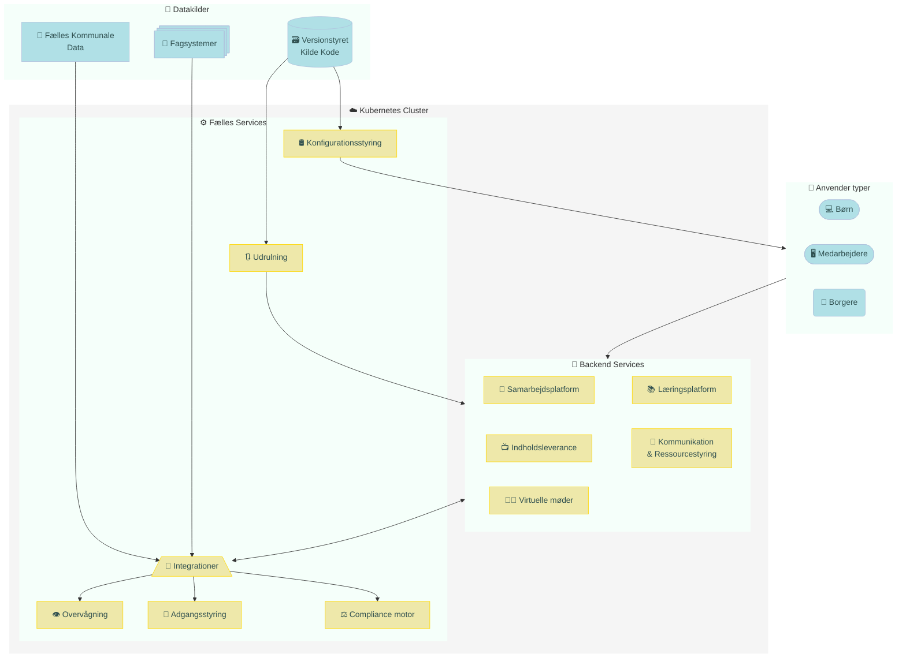



Udkast
{: .label .label-yellow }

## Strategiske mål



  

    <h3>🔐 Kontrol over data</h3>
    
Data opbevares og behandles lokalt eller på betroede infrastrukturer. Ingen uautoriseret tredjepartsadgang.

  

  

    <h3>🔍 Transparens</h3>
    
Kildekode og systemadfærd er synlig og kan verificeres. Ingen skjulte processer eller black boxes.

  

  

    <h3>🔗 Interoperabilitet</h3>
    
Standardiserede API’er og datamodeller sikrer samspil med andre systemer – både offentlige og private.

  

  

    <h3>🧩 Løskobling</h3>
    
Løsningen er sammensat af udskiftelige komponenter. Ingen leverandørlåsning. Let at tilpasse og udvide.

  

  

    <h3>⚖️ Retten til at vælge</h3>
    
Organisationen vælger selv leverandører til hosting, udvikling og vedligehold – uden afhængighed af kommercielle cloud-platforme.

  

  

    <h3>📜 Lovlighed og ansvarlighed</h3>
    
Automatiseret dokumentation af databehandling og konsekvensanalyse. Beviser for lovlighed – ikke blot tro & love.

  



---
## Løsningslandskab

## Applikationer





| Kategori i diagram              | Funktion                                | Type (teknisk)                             | Anbefalet komponent                          | Runners-up                                      |
|--------------------------------|-----------------------------------------|--------------------------------------------|----------------------------------------------|-------------------------------------------------|
| Kommunikation & Ressourcestyring | Email, Kalender, Kontakter              | Groupware backend (SMTP, IMAP, CalDAV, CardDAV) + webklient | [Grommunio (Gromox + Web)](https://grommunio.com/features/) | OpenXchange <small>(OpenDesk)</small>                         |
| Virtuelle møder                | Videomøder                              | WebRTC-server og webklient                 | [Jitsi Meet](https://jitsi.org/jitsi-meet/)  | Nextcloud Talk                                  |
| Samarbejdsplatform             | Dokumentredigering (tekst, regneark, præsentationer)                   | Online kontorpakke  | [Collabora Online <small>(OpenDesk)</small>](https://www.collaboraonline.com/) | La Suite Numérique, CryptPad                 |
| Samarbejdsplatform             | Dokumentdeling                         | WebDAV-server og webklient                 | [Nextcloud <small>(OpenDesk)</small>](https://nextcloud.com/features/)  | OwnCloud                                        |
| Læringsplatform                | Undervisning                            | Learning Management System (LMS) server og webklient | [Canvas LMS](https://www.instructure.com/canvas) | Moodle, Open edX                                |
| Kommunikation                  | Korte beskeder                          | Realtime messaging server og webklient     | [Zulip](https://zulip.com/features/)          | Matrix + Element <small>(OpenDesk)</small>                    |
