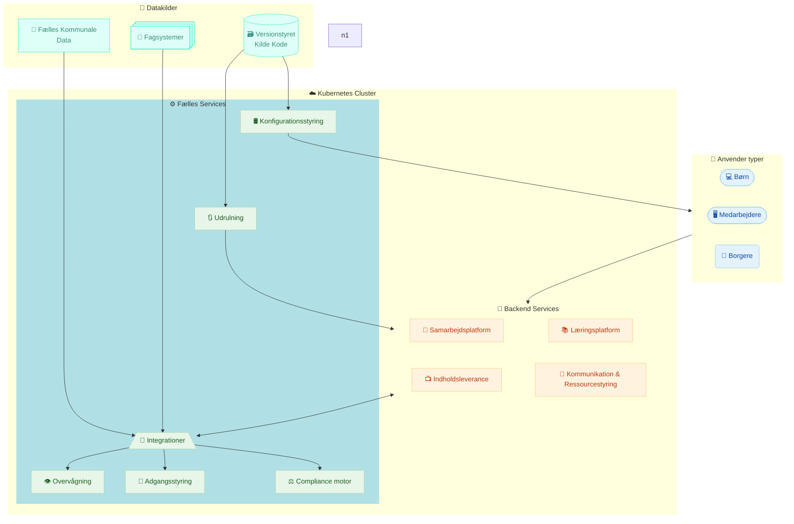



Udkast
{: .label .label-yellow }

  

    <h3>🔐 Kontrol over data</h3>
    
Data opbevares og behandles lokalt eller på betroede infrastrukturer. Ingen uautoriseret tredjepartsadgang.

  

  

    <h3>🔍 Transparens</h3>
    
Kildekode og systemadfærd er synlig og kan verificeres. Ingen skjulte processer eller black boxes.

  

  

    <h3>🔗 Interoperabilitet</h3>
    
Standardiserede API’er og datamodeller sikrer samspil med andre systemer – både offentlige og private.

  

  

    <h3>🧩 Løskobling</h3>
    
Løsningen er sammensat af udskiftelige komponenter. Ingen leverandørlåsning. Let at tilpasse og udvide.

  

  

    <h3>⚖️ Retten til at vælge</h3>
    
Organisationen vælger selv leverandører til hosting, udvikling og vedligehold – uden afhængighed af kommercielle cloud-platforme.

  

  

    <h3>📜 Lovlighed og ansvarlighed</h3>
    
Automatiseret dokumentation af databehandling og konsekvensanalyse. Beviser for lovlighed – ikke blot tro & love.

  

---

