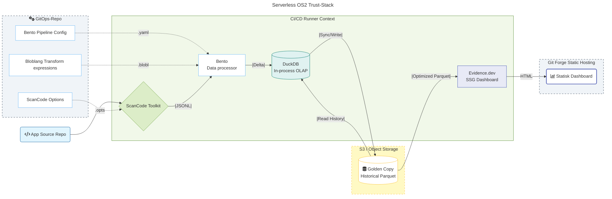



Udkast  
{: .label .label-yellow }

## Baggrund

Dette dokument adresserer behovet for at evaluere **helbred, bæredygtighed og genanvendelighed** af open source-projekter via **data-drevet indsigt**. De nuværende udfordringer er primært knyttet til fraværet af **gennemsigtig, automatiseret** dataindsamling og rapportering uden at pådrage sig driftsbyrden fra leverandør og infrastruktur bundne datawarehouses og BI-værktøjer.

# Arkitektur anbefaling

> ### Det anbefales at **etablere et Serverless BI/DataOps Proof-of-Concept (PoC)** med en løskoblet Serverless BI-tilgang, hvor analyser er **versionsstyrede**, og rapporter genereres **on-demand** uden dedikeret infrastruktur..

## Komponenter
_Arkitekturlandskab_

#### [AboutCode ScanCode](https://scancode-toolkit.readthedocs.io/)

> ScanCode fungerer som den primære motor til **compliance- og sårbarhedsanalyse**. Den er konfigureret deklarativt via en `.opts` fil fra et centralt **GitOps-repo**, hvilket sikrer, at scannings-policies er versionerede og ensartede. ScanCode genererer rådata i **JSONL-format**, hvilket gør det muligt at streame resultaterne direkte videre til transformation uden at overbelaste hukommelsen i CI/CD-runneren.

#### [WarpStream Bento](https://github.com/warpstreamlabs/bento)

> Bento fungerer som den **serverløse transformations-motor**. Ved hjælp af det deklarative sprog **Bloblang** mapper, filtrerer og fladgør Bento de komplekse JSON-data fra ScanCode. Dette eliminerer behovet for specialskrevet Python-kode og gør datahåndteringen "stream-native", så selv meget store scanninger kan behandles effektivt i en container.

#### [S3 / Object Storage](https://en.wikipedia.org/wiki/Amazon_S3)

> S3 fungerer som den **serverløse persistens-løsning** og fungerer som "Source of Truth" for historiske data. Ved at opbevare en **"Golden Copy" i Parquet-format** på S3, kan pipelinen udføre **inkrementel delta-loading**. Det betyder, at kun nye ændringer processeres, hvilket sparer tid og beregningsressourcer, samtidig med at historiske trends bevares på tværs af kørsler.

#### [DuckDB](https://duckdb.org/)

> DuckDB fungerer som den højperformante **in-process OLAP-motor**. Den læser de transformerede data fra Bento og de historiske data fra S3 for at udføre lynhurtige SQL-joins og filtreringer. DuckDB konsoliderer resultaterne til optimerede **Parquet-filer**, som Evidence.dev bruger til at generere dashboardet.

#### [Evidence](https://www.evidence.dev/)

> Evidence er et **Data-as-Code** rapporteringsværktøj, der tager de præ-processerede Parquet-filer og transformerer dem til **statiske dashboards** via versionsstyret Markdown og SQL. Dette sikrer, at compliance-rapporterne er lynhurtige, auditerbare og kan hostes uden en aktiv database-server.

#### [CI/CD Runners](https://forgejo.org/docs/latest/user/actions/)

> Fungerer som den **serverløse orkestrator** (f.eks. Forgejo Actions). Runneren eksekverer containere for ScanCode og Bento, orkestrerer dataflowet til S3 via DuckDB, og afslutter med at bygge og deploye det færdige Evidence-dashboard som statiske filer.

#### [Git Forge Pages](https://forgejo.org/docs/latest/user/pages/)

> Leverer det færdige dashboard fra Evidence og gør det tilgængeligt som en versioneret hjemmeside. Da sitet er **rent statisk**, kræver det ingen backend-infrastruktur, hvilket minimerer både sikkerhedsrisici og driftsomkostninger.

### Opsummering:

[ScanCode](https://scancode-toolkit.readthedocs.io/) analyserer koden ➡️ [Bento](https://github.com/warpstreamlabs/bento) transformerer dataene ➡️ [DuckDB](https://duckdb.org/) håndterer delta-loading mod [S3](https://en.wikipedia.org/wiki/Amazon_S3) og ➡️ [Evidence](https://www.evidence.dev/) genererer de statiske rapporter, som publiceres automatisk via [CI/CD](https://forgejo.org/docs/latest/user/actions/) uden behov for vedvarende serverdrift.

---

# Forventede gevinster

### 💰 Driftsøkonomi og Digital Suverænitet
> Løsningen er baseret på et **serverløst paradigme**, hvilket eliminerer behovet for proprietære SaaS-licenser og aktive databaseservere. Ved at anvende **Object Storage (S3)** og ephemeral beregning i CI/CD, sikres fuldt ejerskab over egne data uden risiko for vendor lock-in eller uforudsigelige prisstigninger.

### 🧠 Open Source Ejerskab og AGPL-Skabelon
> Hele pipelinen leveres som en **AGPL-licenseret skabelon**, hvilket garanterer fuld handlefrihed og gennemsigtighed. Ved at eje kildekoden til både transformationer og dashboards opnår organisationen **digital suverænitet**, hvor kontrol over compliance-regler og historik forbliver intern, mens fællesskabet kan bidrage til skabelonens udvikling.

### ⚡ BI-as-Code og Skalerbar Performance
> Ved at definere alt fra scanningsparametre til transformationer som kode (**Bloblang/SQL**), opnås fuld sporbarhed via Git. Kombinationen af **JSONL-streaming** og **DuckDB** gør det muligt at håndtere store datamængder effektivt og levere lynhurtige, statiske dashboards via **Evidence.dev** uden behov for tunge BI-klienter.

---

# Anvendte arkitekturprincipper

* **Serverless First:** Prioriterer værktøjer og services, der skalerer til nul og minimerer driftsbyrden (GitHub Actions, Evidence's statiske output).
* **GitOps (Configuration as Code):** Al kildekode, konfiguration (Meltano), transformationer (SQL/dbt) og *selve dataens state* (SQLite-filen) er **versionsstyret i Git**.
* **Best-of-Breed Open Source:** Anvender specialiserede, modne open source-værktøjer (Meltano til ELT, Evidence til rapportering, DuckDB/SQLite til datahåndtering) for at undgå *vendor lock-in*.
* **Data Integrity & Traceability:** Ved at committe den opdaterede SQLite-fil sikres det, at de genererede rapporter altid er baseret på **den senest synkroniserede dataversion** i repositoryet.
