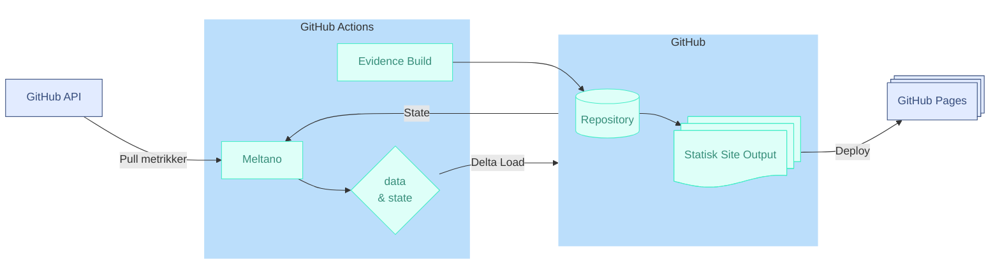



Udkast  
{: .label .label-yellow }

## Baggrund

Dette dokument adresserer behovet for at evaluere **helbred, bæredygtighed og genanvendelighed** af open source-projekter via **data-drevet indsigt**. De nuværende udfordringer er primært knyttet til fraværet af **gennemsigtig, automatiseret** dataindsamling og rapportering uden at pådrage sig driftsbyrden fra leverandør og infrastruktur bundne datawarehouses og BI-værktøjer.

# Arkitektur anbefaling

> ### Det anbefales at **etablere et Serverless BI/DataOps Proof-of-Concept (PoC)** med en løskoblet Serverless BI-tilgang, hvor analyser er **versionsstyrede**, og rapporter genereres **on-demand** uden dedikeret infrastruktur..

## Komponenter
_Arkitekturlandskab_

#### [Meltano](https://www.meltano.com/)

> Meltano fungerer som data extract og loadmotor og bruger **Singer-protokollen** til at trække data via []`tap-github`. Den er essentiel for at sikre **inkrementel replikering** af metrikker og for at indkapsle *hele* dataudtræksprocessen i én container. Meltano er konfigureret til at bruge den samme **SQLite-fil** som både tilstandslager (`.meltano/meltano.sqlite`) og datalager (`data/pipeline.sqlite`).

#### [Evidence](https://www.evidence.dev/)

> Evidence er et **Data-as-Code** rapporteringsværktøj, der tager live-data og transformerer det til **statiske rapporter** via versionsstyret Markdown og SQL. Dette flow sikrer, at analyser er **versionerede, auditerbare** og **transparente**.

#### [GitHub Actions](https://github.com/features/actions)

> Fungerer som **serverless orkestrator** og tidsbaseret scheduler. GitHub Actions eksekverer Meltano-containeren, håndterer **State Persistence** i git, og afslutter med at bygge og deploye Evidence-sitet til GitHub Pages.

#### [GitHub Pages](https://docs.github.com/en/pages)
> Leverer statiske rapporter fra Evidence og gør dem tilgængelige som en versioneret hjemmeside direkte fra Git-repositoriet.

### Opsummering:

[Meltano](https://www.meltano.com/) henter data, [Evidence](https://www.evidence.dev/)  genererer rapporter, og [GitHub Actions](https://github.com/features/actions) sørger for, at det hele sker automatisk – med publicering til [GitHub Pages](https://docs.github.com/en/pages) uden behov for servere eller manuel indsats. 

---

# Forventede gevinster

### 💰 Reduktion af driftsbyrden
> Løsningen er **serverløs**, hvilket eliminerer behovet for at **drifte, opdatere og betale for en persistent database** og et traditionelt BI-værktøj. Omkostninger er primært knyttet til den minimale beregningstid i GitHub Actions.

### 🧠 BI as Code og Genanvendelighed
> **Hele analysen** (data, transformation, rapport) er versionsstyret i Git. Dette sikrer **fuld sporbarhed** (*traceability*) og gør det muligt at **genanvende** og klone løsningen med minimal indsats for nye projekter (princippet om **Infrastructure as Code** udvidet til data).

### ⚡ Hurtig og Transparent Levering
> Rapporter genereres **hurtigt** som statiske HTML-sider, der kan **deles uden login** (via GitHub Pages), hvilket sikrer **transparens** og nem adgang for både tekniske og forretningsmæssige interessenter.

---

# Anvendte arkitekturprincipper

* **Serverless First:** Prioriterer værktøjer og services, der skalerer til nul og minimerer driftsbyrden (GitHub Actions, Evidence's statiske output).
* **GitOps (Configuration as Code):** Al kildekode, konfiguration (Meltano), transformationer (SQL/dbt) og *selve dataens state* (SQLite-filen) er **versionsstyret i Git**.
* **Best-of-Breed Open Source:** Anvender specialiserede, modne open source-værktøjer (Meltano til ELT, Evidence til rapportering, DuckDB/SQLite til datahåndtering) for at undgå *vendor lock-in*.
* **Data Integrity & Traceability:** Ved at committe den opdaterede SQLite-fil sikres det, at de genererede rapporter altid er baseret på **den senest synkroniserede dataversion** i repositoryet.
