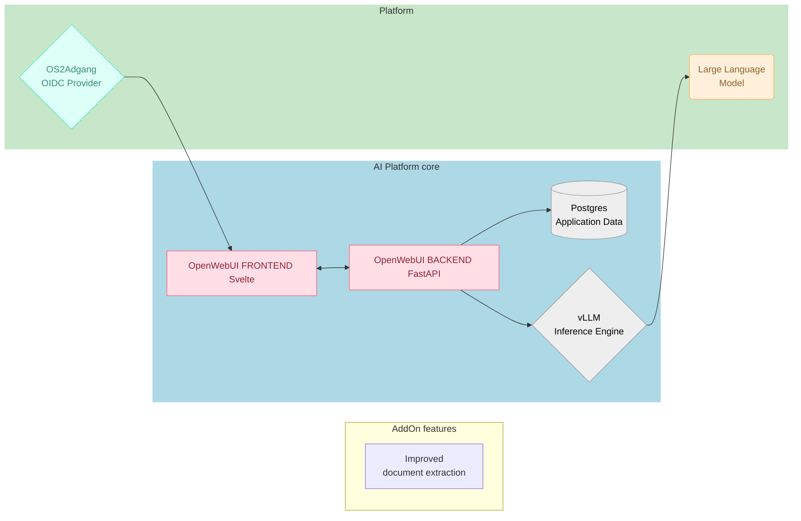



Udkast
{: .label .label-yellow }

# Arkitektur anbefaling

---

> ### Det anbefales at undgå risici for opbygning af **unødvendige vedligeholdelsesomkostninger**, **leverandørafhængigheder** og betydelig **teknisk gæld** -- ved at starte med en minimal "Core stack" og genbruge eksisterende standardisereder Open Source komponenter.
>

---
## Komponenter
---

#### **[OpenWebUI](https://) (TBD)**

> Den UI

#### **[OS2Adgang](https://fi) (Based on KeyCloak provider)**
> Implementerer 

#### **[vLLM](https://q) (Inference Engine)**
> en **Time Series Database** Modulet er kritisk for at sikre **historisk lagring** uden at belaste Context Brokeren.

Opsummering:

# Forventede gevinster
---

### 🚀 ---
> Gevinst

