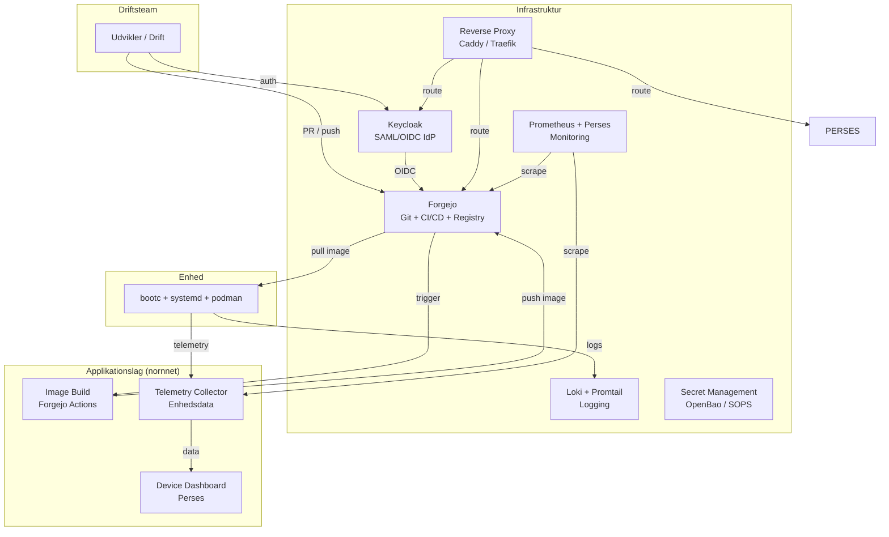



under review
{: .label .label-yellow }
> ⚠️ **Dette dokument er under review og ændres løbende indtil det er godkendt **

---

not production ready!
{: .label .label-red }

> ⚠️ **Dette dokument beskriver en PoC-backendstack og er IKKE udtryk for en production ready stack.** Komponenter som backup, DNS/DHCP og HA og andre elementer der skal være til stede for en produktions-klar stack, er udeladt og skal etableres før produktionsdrift.

## Baggrund

Nornnet-enheder trækker opdateringer via en pull-model. Dette kræver en række backing services: et sted at opbevare kode, bygge images, distribuere opdateringer, modtage telemetry og styre adgang.

Dette dokument beskriver den samlede backend-stack – inddelt i **infrastrukturservices** og **applikationsservices** – der skal til for at drive nornnet.

---

# Arkitektur anbefaling

> ### Det anbefales at etablere en komponerbar, åben backend-stack baseret på containeriserede services, hvor hvert komponent er udskiftelig og infrastrukturen defineres som kode.

Alle services køres som containere – enten via **Podman med systemd-quadlets** eller på en eksisterende **Kubernetes-platform**. Valg af kørselsplatform afhænger af det eksisterende driftsmiljø.

---

## Komponenter
_Arkitekturlandskab_

---

# Infrastrukturservices

### **[Forgejo](https://forgejo.org/) (Git Forge + CI/CD + Container Registry)**

> Forgejo er en letvægts, fællesskabsdrevet fork af Gitea med indbygget CI/CD (Forgejo Actions) og container registry.

Forgejo udgør kernen i backenden. Den håndterer:
- **Git-repositorier** for alle bootc-image-definitioner, konfigurationer og pipelines
- **Forgejo Actions** til CI/CD (byg bootc-images, scan for sårbarheder, push til registry)
- **Container Registry** til opbevaring af OCI-images

Forgejo understøtter SAML/OIDC-integration, så der kan kobles til en ekstern IdP.

### **[Keycloak](https://www.keycloak.org/) (SAML/OIDC Identity Provider)**

> Keycloak leverer centraliseret brugerstyring, SSO og adgangskontrol.

Keycloak fungerer som den primære IdP for backend-services. Forgejo og andre services autentificerer brugere via OIDC mod Keycloak. Det gør det muligt at styre adgange ét sted og understøtte SSO på tværs af services.

_Til PoC kan lokal brugerstyring i Forgejo bruges som overgang, med senere migrering til Keycloak._

### **[Caddy](https://caddyserver.com/) eller [Traefik](https://traefik.io/) (Reverse Proxy)**

> Reverse proxy med automatisk TLS-terminering og routing til backend-services.

Alle backend-services placeres bag en reverse proxy, der håndterer TLS-certifikater og trafikrouting.
- **Caddy:** Enkel konfiguration, automatiske HTTPS-certifikater via Let's Encrypt.
- **Traefik:** Bedre egnet til containeriserede miljøer med automatisk serviceopdagelse.

### **[Loki](https://grafana.com/oss/loki/) + [Promtail](https://grafana.com/docs/loki/latest/send-data/promtail/) (Logging)**

> Centraliseret logopsamling fra både backend-services og enheder.

Loki er et letvægts logaggregeringssystem fra Grafana Labs. Promtail-aggenter opsamler logs fra enhederne og sender til Loki. Logs kan søges, filtreres og visualiseres via Perses.

### **[Prometheus](https://prometheus.io/) + [Perses](https://perses.dev/) (Monitoring)**

> Målinger, alarmering og dashboards for både backend og enheder.

Prometheus indsamler metrikker fra alle backend-services og enheder. Perses er et CNCF Sandbox-projekt til Prometheus-visualisering med dashboard-as-code – dashboards defineres som JSON/YAML i Git og versioneres sammen med øvrig konfiguration.

> **I produktion vælger den enkelte implementering selv sit overvågningsværktøj.** Perses anvendes her til demo/PoC. Andre muligheder er bl.a. [SigNoz](https://signoz.io/) (Apache 2.0), [Ace Observability](https://aceobservability.com/) eller lignende OSI-licenserede alternativer.

### **Secret Management (OpenBao / SOPS)**

> Sikker opbevaring af credentials, certifikater og hemmeligheder.

CI/CD-pipelines har brug for adgang til credentials (registry-nøgler, signeringstokens osv.).
- **[OpenBao](https://openbao.org/):** Linux Foundation-fork af Vault med åben licens (MPL 2.0). Fuldt udstyret secret management med dynamiske secrets.
- **[SOPS](https://github.com/getsops/sops):** Letvægts alternativ til kryptering af secrets direkte i Git.

---

# Applikationsservices (nornnet)

### **Image Build Pipeline (Forgejo Actions)**

> CI/CD-pipeline der bygger lagdelte bootc-images fra Git.

Når en Pull Request merges i et image-repositorie, triggeres en Forgejo Actions-pipeline der:
1. Bygger det lagdelte bootc-image (BaseOS → Domain → Location)
2. Scanner image for sårbarheder (f.eks. med Trivy)
3. Signerer image med nøgle fra Secret Management
4. Pusher det færdige image til container registry

### **Telemetry Collector**

> Modtager og lagrer enhedsdata: health, status, opdateringshistorik, compliance.

Telemetry-data sendes fra enhederne til et centralt endpoint. Data lagres i en tidsrækkedatabase (f.eks. InfluxDB, Prometheus eller PostgreSQL afhængigt af datatyper).

### **Device Dashboard (Perses)**

> Oversigt over flådens tilstand på tre niveauer – altid read-only.

Perses-dashboards bygget ovenpå Prometheus giver et samlet overblik over flåden:
- **Fleet-level:** Overordnet compliance-dashboard – hvor mange enheder er opdaterede, fejlrate, globale afvigelser
- **Location-level:** Drill-down til f.eks. DOKK1 eller Bautavej – lokationsspecifik status
- **Device-level:** Enkelt-enheds health, status og telemetry til fejlfinding

Dashboardet er read-only. Alle konfigurationsændringer skal komme via Pull Requests.

---

# Kørselsplatform

Alle backend-services køres som containere. Valg af platform:

| Kriterium | Podman + Quadlets | Kubernetes (K3s) |
|---|---|---|
| **Enkelthed** | Enkel, få bevægelige dele | Mere kompleks, flere abstraktioner |
| **Egnethed til PoC** | Ideelt til mindre udrulninger | Bedre egnet til større miljøer |
| **Orkestrering** | systemd styrer alt | K8s styrer alt |
| **Høj tilgængelighed** | Kræver manuel opsætning | Indbygget med K8s |

For PoC anbefales **Podman med systemd-quadlets** for enkelthedens skyld. Hvis omkostningerne til at køre PoC'en på K8s er sammenlignelige med et Podman/Quadlets-setup, er K8s selvfølgelig også acceptabelt. Ved skalaering til MvP og 1.0 kan platformen migreres til Kubernetes uden at ændre container-images.

---

# Forventede gevinster

### 🔓 Fuldt åben stack
> **Ingen proprietære afhængigheder.** Alle komponenter er open source. Hver komponent kan skiftes ud uden at ændre den overordnede arkitektur.

### 📦 Komponenter er udskiftelige
> **Skræddersy stacken efter behov.** Er Caddy for simpel? Skift til Traefik. Har I allerede OpenBao i drift? Brug det i stedet for SOPS. Arkitekturen er designet til valgfrihed.

### 🔄 Infrastruktur som kode
> **Hele backenden defineres i Git.** Compose-filer, quadlet-definitioner og CI/CD-pipelines – alt er versioneret, gennemgået og auditable via Pull Requests.

### 📏 12-factor compliance
> **Hver service konfigureres via miljøvariabler, er stateless hvor muligt, og kan skaleres uafhængigt.** Det letter drift, backup og genetablering.

---

# Anvendte principper

- **12-factor app:** Konfiguration via miljøvariabler, stateless services, log til stdout
- **Infrastruktur som kode:** Alt defineres i Git, intet manuelt
- **Separation af concerns:** Infrastruktur og applikation adskilt i lag
- **Åbne standarder:** OCI, OIDC, syslog, Prometheus-metrics – ingen proprietære protokoller
- **Komponenter er udskiftelige:** Hver komponent kan skiftes ud uden at ændre arkitekturen

---

## Risici og mitigering

- **Kompleksitet af mange komponenter**
  _Afbødes gennem standardiserede Compose-filer og dokumentation. De fleste komponenter er "sæt op og glem"-services i drift._

- **Kompetencebehov**
  _Driftsteamet skal mestre containerisering, GitOps og de enkelte services. Afbødes gennem fælles træning._

- **PoC til skalaering**
  _Podman + Quadlets kan blive en flaskehals ved større udrulninger. Afbødes ved at designe images til at være platformuafhængige._

---

## Bilag og ressourcer

- **Forgejo**
  [forgejo.org](https://forgejo.org/)

- **Keycloak**
  [keycloak.org](https://www.keycloak.org/)

- **Caddy**
  [caddyserver.com](https://caddyserver.com/)

- **Loki**
  [grafana.com/oss/loki](https://grafana.com/oss/loki/)

- **Prometheus**
  [prometheus.io](https://prometheus.io/)

- **Perses**
  [perses.dev](https://perses.dev/) (CNCF Sandbox)

- **OpenBao**
  [openbao.org](https://openbao.org/)

- **Hovedforslag**
  [Se: nornnet-enhedsstyring med GitOps]()

---
