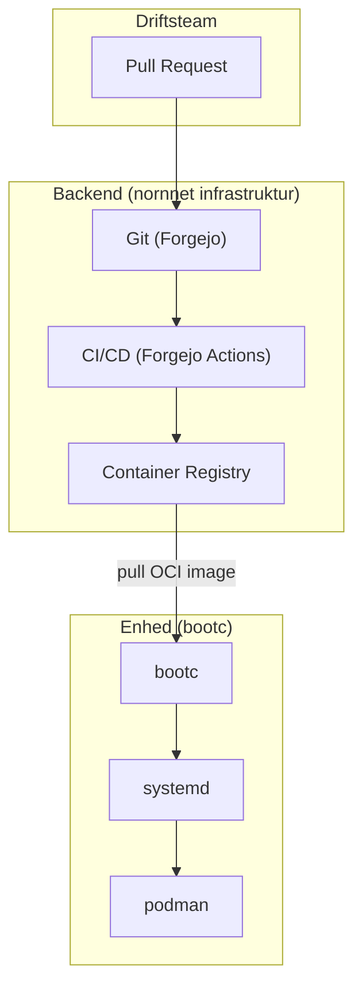
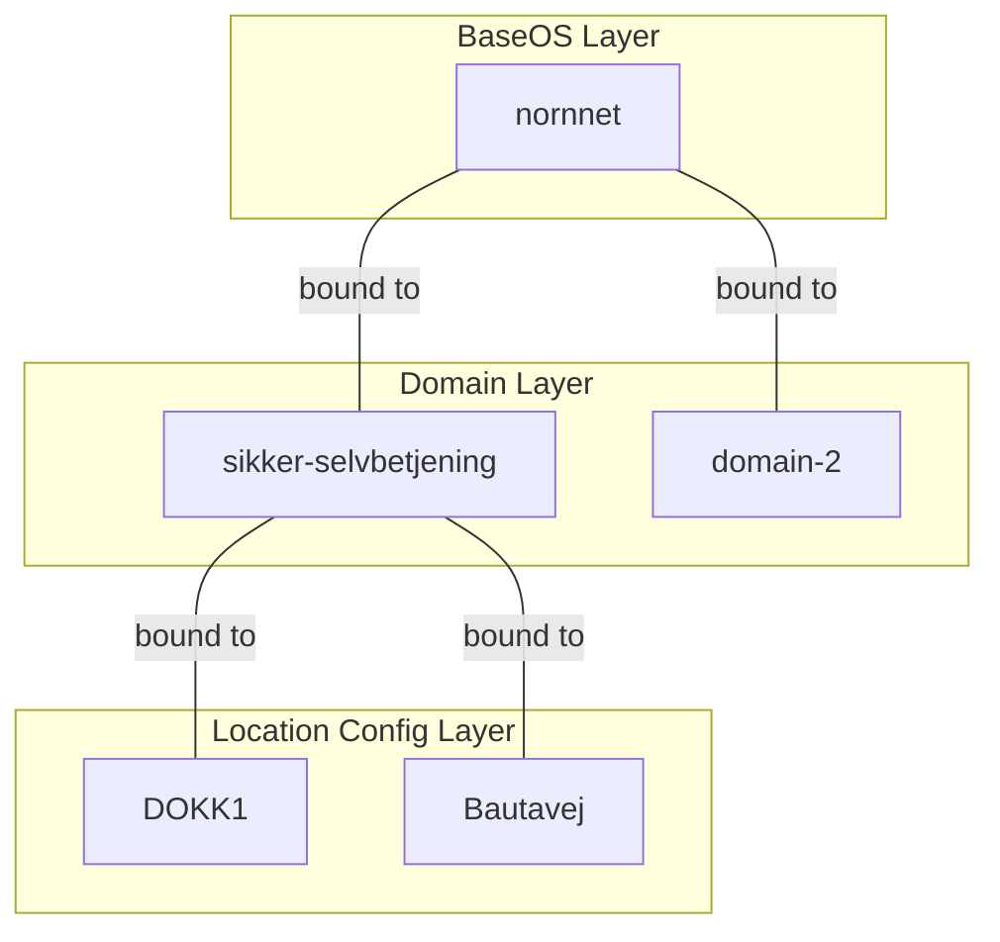



Udkast  
{: .label .label-yellow }

## Baggrund

Den nuværende løsning til styring af Linux-klienter er over 10 år gammel og kræver stigende ressourcer til vedligehold og videreudvikling.
Vi står over for et strategisk valg: Skal vi fortsætte med en aldrende, specialudviklet løsning til Linux-klientstyring – eller tage springet til en moderne, fælles platform, der bygger på åbne standarder og globalt samarbejde?

Dette forslag anbefaler en **kontrolleret overgang** til [nornnet](https://github.com/OS2sandbox/nornnet) – en GitOps-baseret enhedsstyringsplatform bygget på **bootable containers (bootc)**, **systemd** og **podman**.
Målet er at skabe en **fælles, automatiseret styringsmodel for alle klienttyper** – fra en selvbetjenings-PC i borgerservice til en fuld kontorarbejdsplads.

I PoC-fasen fokuseres på ét domæne: **sikker selvbetjening**.

---

## Arkitektur anbefaling

> ### Det anbefales at etablere en ren GitOps-stack baseret på bootc, systemd og podman, hvor Git udgør den eneste kilde til sandhed, og hvor alle services køres som containere uden behov for 3.parts agenter.

Den traditionelle tilgang til enhedsstyring involverer agenter installeret på hver enhed, centrale management-servere med åbne porte ind til enhederne, og manuelle driftsprocesser.
Nornnet afløser dette med tre fundamentale principper:

- **Pull, ikke push:** Enhederne henter selv opdateringer – ingen åbne management-porte (SSH, osv.) ind udefra.
- **Immutable OS:** Operativsystemet leveres som et read-only OCI-image. Ingen utilsigtet manipulation af basen.
- **Ingen 3.parts agenter:** Livscyklus håndteres af systemd – systemets egen service manager.

---

## Komponenter
_Arkitekturlandskab_

### **[bootc](https://containers.github.io/bootc/) (Bootable Containers)**

> Bootable containers tager den samme model vi kender fra containeriserede applikationer og bringer den til operativsystemet. Bootc er det værktøj der bringer containers til hardware.

Operativsystemet leveres som et **uforanderligt OCI-image**. Det betyder at alle enheder er binært identiske, og at sikkerhedsscanning kan foretages allerede før udrulning.
Opdateringer er **transaktionelle** – hvis et image fejler, rulles der automatisk tilbage til den tidligere stabile version.

### **[systemd](https://systemd.io/) (Native Lifecycle Management)**

> Systemd håndterer enhedens livscyklus som en integreret del af operativsystemet – uden behov for eksterne agenter.

Systemd styrer services, watchdogs, timers og boot-forløb. Via **quadlets** kan podman-containers defineres som systemd-services, hvilket giver ensartet styring af både OS-services og applikationscontainere.

### **[podman](https://podman.io/) (Container Runtime)**

> Alle services på enhederne køres som podman-containers – fra web-browsere til selvbetjeningsapplikationer.

Podman kører rootless som standard og kræver ingen daemon. Det giver en sikker, letvægts container-runtime der er egnet til klientenheder med begrænsede ressourcer.

### **Git som Single Source of Truth**

> Flådens samlede tilstand defineres versioneret i Git. Alle infrastrukturændringer udføres via formelle Pull Requests.

Dette sikrer en **fuld audit-log** og 100% sporbarhed på alle ændringer. CI/CD-pipelines bygger automatisk nye images ved merge, og enhederne trækker opdateringer fra container registry.

---

## Lagdelt image-arkitektur

Nornnet anvender en **lagdelt tilgang** til bootc-images, der muliggør genbrug og tilpasning på tværs af niveauer:

- **BaseOS (nornnet)** – Det fundamentale bootc-image med operativsystem, systemd, podman og basiskonfiguration.
- **Domain Layer** – Domæne-specifik funktionalitet. Til PoC: **sikker selvbetjening** (låst browser, kiosk-tilstand, netværkskonfiguration). Senere udvides med flere domæner.
- **Location Config** – Lokationsspecifik konfiguration (f.eks. skærmopsætning, netværk, branding). Hvert site får sit eget konfigurationslag.

---

# Forventede gevinster
---

### 💰 Lavere totalomkostninger
> **Færre komponenter, ingen licenser, mindre vedligehold.** Ved at eliminere 3.parts agenter og centrale management-servere reduceres både licens- og driftsomkostninger. Bootc og systemd er indbygget i Linux-kernen – der er intet at installere eller licensere.

### 🔒 Øget sikkerhed
> **Immutable OS eliminerer hele klasser af angreb.** Med en read-only root filesystem og en pull-model uden åbne inbound-porte reduceres angrebsfladen markant. Alle images scannes for sårbarheder allerede i CI/CD-pipeline.

### ⚙️ Forenklet drift
> **Kun Git-kompetencer påkrævet.** Driftsteamet arbejder med Pull Requests i stedet for manuelle scripts på enheder. Reconciliation-pattern sikrer at enhederne altid konvergerer mod den ønskede tilstand.

### 🌐 Leverandøruafhængighed
> **Fedora først, alle bootc-kompatible distributioner senere.** Ved at basere sig på åbne standarder (OCI, systemd, podman) er arkitekturen ikke låst til én leverandør eller distribution.

### 📈 Skalerbarhed
> **Fra 10 enheder i PoC til tusindvis.** Den lagdelte image-arkitektur gør det muligt at dele et fælles BaseOS-image på tværs af alle enheder, mens domæne- og lokationslag tilpasses behovet. Flåden vokser uden at driftskompleksiteten vokser proportionelt.

---

# Anvendte arkitekturprincipper

- **Åbenhed og genbrug** af eksisterende open source-løsninger
- **GitOps:** Alt defineret i versioneret kode, intet manuelt
- **Separation af concerns:** Lagdelt arkitektur (BaseOS → Domain → Location)
- **Immutable infrastructure:** Enheder behandles som kvæg, ikke kæledyr
- **OS²-principper** om fælles udvikling og vedligehold
- **Upstream first:** Bidrage tilbage til bootc, systemd og podman-projekterne

---

## Risici og mitigering

- **Migreringsrisici fra BorgerPC**
  _Afbødes gennem trinvis udrulning – nye enheder først, eksisterende migreres over tid_

- **Kompetencebehov i driftsteamet**
  _GitOps, bootc og systemd-quadlets kræver ny viden. Afbødes gennem fælles træning og fællesskab._

- **Modenhed af bootc-økosystemet**
  _Afbødes ved at starte med Fedora (moden base) og gradvist udvide til andre distributioner_

- **Afhængighed af upstream roadmap**
  _Afbødes ved aktiv deltagelse i bootc- og systemd-fællesskaberne_

---

## Bilag og ressourcer

- **Nornnet-repositorie**
  [github.com/OS2sandbox/nornnet](https://github.com/OS2sandbox/nornnet)

- **Getting Started with Bootable Containers**
  [YouTube: Valentin Rothberg – Bootc overview](https://www.youtube.com/watch?v=bf1xqjLeA9M)

- **bootc-dokumentation**
  [containers.github.io/bootc](https://containers.github.io/bootc/)

- **systemd-dokumentation**
  [systemd.io](https://systemd.io/)

- **Podman-dokumentation**
  [podman.io](https://podman.io/)

- **Backend-infrastruktur**
  [Se separat dokument: nornnet backend-stack]()

---
