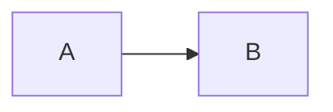



Udkast  
{: .label .label-yellow }

## Baggrund

<!-- [Beskriv den kontekst eller problemstilling, som dokumentet adresserer.] -->
<!-- [Hvad er de nuværende udfordringer, og hvorfor er der behov for denne indsats?] -->

# Arkitektur anbefaling

---

> ### Det anbefales at <!-- Anbefalinger...-->

## Komponenter
_Arkitekturlandskab_

---

Højniveau arkitekturlandskab i mermaid

#### **[Komponent A](https://link/) (Beskrivende linktekst)**

> Komponent A beskrivelse

Opsummering: <!-- komponent opsummering med links -->

# Forventede gevinster
---

### <!-- f.eks 💰 Reduktion af driftsbyrden -->
> Brødtekst med **effekten** i bold

# Anvendte arkitekturprincipper
