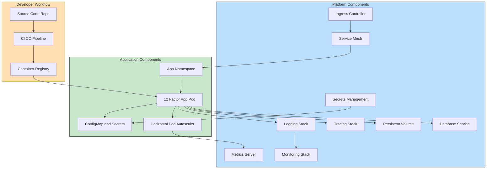

```mermaid
flowchart TD
 subgraph s1["Developer Workflow"]
        A["Source Code Repo"]
        B["CI CD Pipeline"]
        C["Container Registry"]
  end
 subgraph Platform["Platform Components"]
        D["Ingress Controller"]
        E["Service Mesh"]
        F["Secrets Management"]
        K["Metrics Server"]
        L["Logging Stack"]
        M["Monitoring Stack"]
        N["Tracing Stack"]
        O["Persistent Volume"]
        P["Database Service"]
  end
 subgraph Application["Application Components"]
        G["App Namespace"]
        H["12 Factor App Pod"]
        I["ConfigMap and Secrets"]
        J["Horizontal Pod Autoscaler"]
  end
    A --> B
    B --> C
    C --> H
    D --> E
    E --> G
    G --> H
    H --> I & J & L & N & O & P
    J --> K
    L --> M
    F --> I

    style Platform fill:#BBDEFB,stroke:#333,stroke-width:2px
    style Application fill:#C8E6C9,stroke:#333,stroke-width:2px
    style s1 fill:#FFE0B2


```