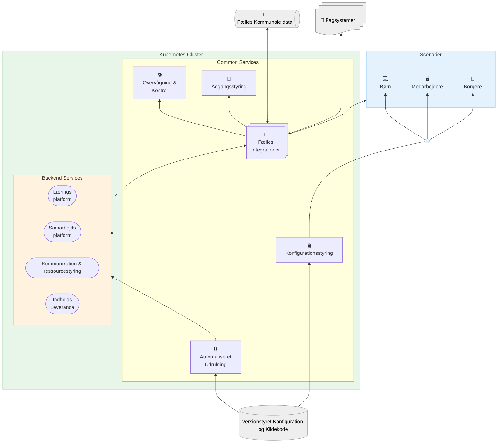



```mermaid
flowchart BT
 subgraph Clients["Scenarier"]
        school["💻 <br>Børn"]
        office["🖥 <br>Medarbejdere"]
        rpi["📱<br>Borgere"]
  end
 subgraph Backend["Backend Services"]
    direction RL
        canvas(["Lærings<br>platform"])
        nextcloud(["Samarbejds<br>platform"])
        groupware(["Kommunikation &amp; ressourcestyring"])
        signage(["Indholds<br>Leverance"])
  end
 subgraph Common["Common Services"]
        n3["🔁<br>Fælles 
        Integrationer"]
        n1["🔃<br>Automatiseret<br>Udrulning"]
        observability["👁<br>Overvågning &amp;<br>Kontrol"]
        auth["🔐<br>Adgangsstyring"]
        fleet["🛢<br>Konfigurationsstyring<br>"]
  end
 subgraph Cluster["Kubernetes Cluster"]
        Backend
        Common
  end
    Cluster --> Backend
    n4["Frames Circle"] --> school & office & rpi
    fleet --- n4
    git["Versionstyret Konfiguration og Kildekode"] --> fleet & n1
    n3 <---> n2["📇<br>Fælles Kommunale data"] & n5["🔆 Fagsystemer<br>"]
    n3 --> auth & Clients & observability
    n1 --> Backend
    Backend --> n3

    school@{ shape: text}
    office@{ shape: text}
    rpi@{ shape: text}
    n3@{ shape: procs}
    fleet@{ shape: rect}
    n4@{ shape: f-circ}
    git@{ shape: h-cyl}
    n2@{ shape: h-cyl}
    n5@{ shape: docs}
        git@{ shape: cyl}
     git:::Ash
     n2:::Aqua
     n2:::Ash
     n5:::Ash
    classDef Aqua stroke-width:1px, stroke-dasharray:none, stroke:#46EDC8, fill:#DEFFF8, color:#378E7A
    classDef Ash stroke-width:1px, stroke-dasharray:none, stroke:#999999, fill:#EEEEEE, color:#000000
    style Backend fill:#fff3e0,stroke:#ffcc80
    style Cluster fill:#e8f5e9,stroke:#a5d6a7
    style n4 fill:#e3f2fd,stroke:#90caf9
    style Clients fill:#e3f2fd,stroke:#90caf9
```